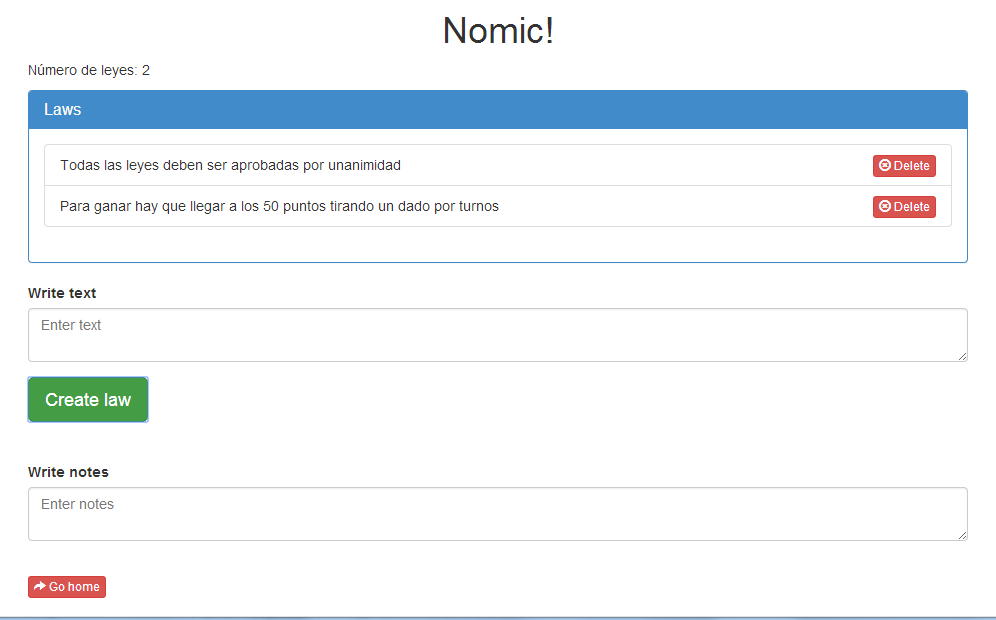

Nomic
=====
Desarrollo del juego [Nomic](http://es.wikipedia.org/wiki/Nomic_(juego)) usando `localStorage` para guardar las reglas y verlas.

Uso
===
Solo tienes que descargarte el proyecto y ejecutar el archivo `html/index.html` en algún navegador web.

Screenshots
===========
*Página index.html*

*Página main.html*

