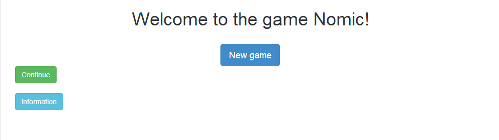

Nomic
=====
Desarrollo del juego [Nomic](http://es.wikipedia.org/wiki/Nomic_(juego) "Nomic") con `jQuery, JavaScript, HTML5 y CSS3`. Hace uso de `localStorage` para guardar y almacenar las reglas del juego. 

Uso
===
Solo tienes que descargarte el proyecto y ejecutar el archivo HTML localizado en `html/index.html` en algún navegador web.

Screenshots
===========
*Página index.html*

*Página main.html*

